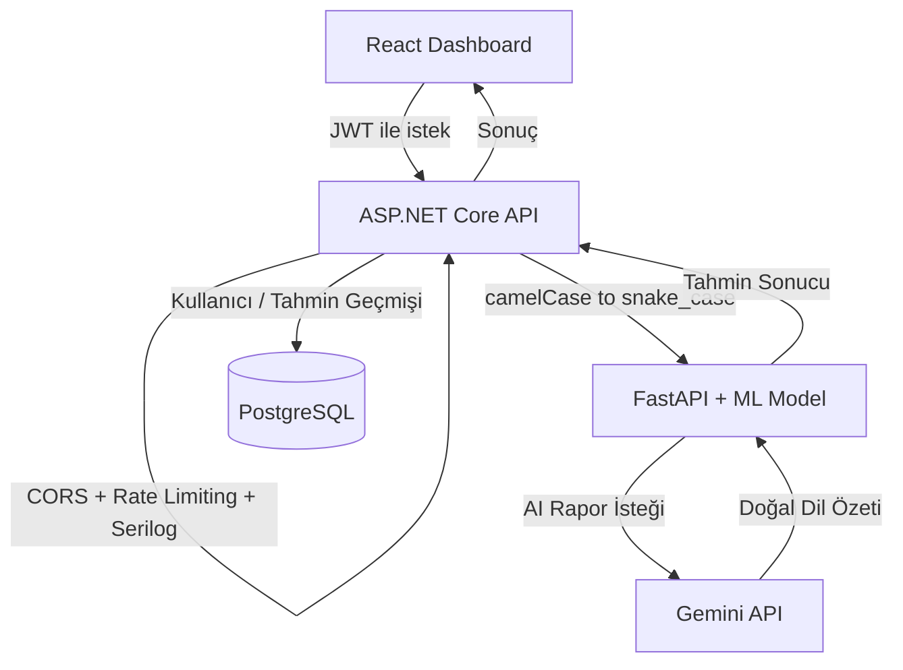

# CAN Bus Anomali Tespit Sistemi

Araç içi CAN bus ağlarındaki saldırı trafiğini (DoS, Fuzzy, Gear/RPM spoofing) makine öğrenmesiyle gerçek zamanlı tespit eden, JWT korumalı bir API üzerinden servis edilen ve AI destekli güvenlik raporları üreten uçtan uca bir sistem.

Gerçek araç CAN bus verisi üzerinde eğitilmiş bir Random Forest modeli; ASP.NET Core ve FastAPI'den oluşan iki katmanlı bir backend; PostgreSQL ile kullanıcı yönetimi; ve React tabanlı bir izleme panosu içerir. Tüm sistem Docker Compose ile tek komutla ayağa kaldırılabilir.

## İçindekiler

- [Özellikler](#özellikler)
- [Mimari](#mimari)
- [Model Performansı](#model-performansı)
- [Teknolojiler](#teknolojiler)
- [Kurulum](#kurulum)
- [Kullanım](#kullanım)
- [Testler ve CI/CD](#testler-ve-cicd)
- [Proje Yapısı](#proje-yapısı)
- [Bilinen Sınırlamalar ve Gelecek Geliştirmeler](#bilinen-sınırlamalar-ve-gelecek-geliştirmeler)

## Özellikler

- **5 sınıflı anomali tespiti** — Normal, DoS, Fuzzy, Gear ve RPM spoofing saldırılarını ayırt eden Random Forest modeli
- **JWT tabanlı kimlik doğrulama** — kayıt/giriş akışı, BCrypt ile hash'lenmiş şifreler
- **Kullanıcı bazlı veri izolasyonu** — her kullanıcı yalnızca kendi tahmin geçmişini görebilir
- **Rate limiting** — dakikada 20 istekle sınırlı, anlamlı hata mesajlarıyla
- **Gerçek zamanlı izleme panosu** — canlı grafik, renk kodlu saldırı türleri, otomatik yenilenen geçmiş tablosu
- **CSV/Excel ile toplu simülasyon** — kullanıcılar kendi trafik verilerini yükleyip analiz ettirebilir
- **AI destekli güvenlik raporu** — Gemini API ile, tespit edilen anomalilerden insan diliyle yazılmış güvenlik özetleri üretme
- **Health check endpoint'leri** — hem API hem veritabanı bağlantısı için
- **Otomatik test kapsamı** — FastAPI için pytest, ASP.NET Core için xUnit
- **CI/CD pipeline** — her push'ta GitHub Actions ile otomatik test
- **Docker Compose ile tek komutla dağıtım** — dört servis (ML API, backend, dashboard, veritabanı) birlikte ayağa kalkar

## Mimari



Kullanıcı ve dashboard yalnızca ASP.NET Core API ile konuşur; FastAPI ve ML modeli arka planda, iç bir servis olarak çalışır. Bu ayrım, kimlik doğrulama/yetkilendirme mantığını backend'de tutarken, ML tarafının bağımsız olarak geliştirilip test edilebilmesini sağlar.

## Model Performansı

Model, [HCRL Car-Hacking Dataset](https://ocslab.hksecurity.net/Datasets/CAN-intrusion-dataset) üzerinde, dört saldırı türünün her biri için ayrı ayrı analiz edilip, özellikleri (CAN ID, mesaj frekansı, zamanlama sapması, veri içeriği sapması) çıkarılarak eğitildi.

| Saldırı Türü | Kullanılan Ana Özellikler | F1-Skoru |
|---|---|---|
| DoS | Zamanlama + frekans | 1.00 |
| Fuzzy | Zamanlama + frekans | 0.99 |
| Gear | Zamanlama + frekans + veri sapması | 1.00 |
| RPM | Zamanlama + frekans + veri sapması | 1.00 |

Model geliştirme sürecinde önemli bir bulgu: Gear ve RPM saldırıları, DoS'un aksine mesaj sıklığını değiştirmiyor — sadece CAN mesajının veri içeriğini (belirli bir byte'ı) sahte bir değerle değiştiriyor. Bu, yalnızca zamanlama tabanlı özelliklerin bu saldırı türlerinde yetersiz kaldığını (precision ~0.93), doğru byte'ın istatistiksel olarak tespit edilip modele eklenmesinin ise performansı kusursuza (1.00) çıkardığını gösterdi.

## Teknolojiler

**Makine Öğrenmesi:** Python, scikit-learn (Random Forest), pandas, NumPy, joblib

**ML Servisi:** FastAPI, Pydantic (veri doğrulama), Uvicorn

**Backend API:** ASP.NET Core (.NET 10), Entity Framework Core, JWT Authentication, BCrypt.Net, Serilog, PostgreSQL (Npgsql)

**Frontend:** React 19, Vite, Recharts, Axios, SheetJS (Excel desteği)

**AI Entegrasyonu:** Google Gemini API (doğal dil güvenlik raporları)

**Altyapı:** Docker, Docker Compose, GitHub Actions (CI/CD)

**Test:** pytest + httpx (FastAPI), xUnit (ASP.NET Core)

## Kurulum

### Gereksinimler

- Docker ve Docker Compose
- (Opsiyonel, model yeniden eğitimi için) Python 3.11+, Jupyter Notebook

### Adımlar

1. Depoyu klonlayın:
   ```bash
   git clone <repo-url>
   cd canbus
   ```

2. Ortam değişkenlerini ayarlayın:
   ```bash
   cp .env.example .env
   ```
   `.env` dosyasını açıp kendi değerlerinizi girin (PostgreSQL şifresi, JWT anahtarı, Gemini API anahtarı). Gemini API anahtarı [Google AI Studio](https://aistudio.google.com/apikey) üzerinden ücretsiz alınabilir; anahtar girilmezse sistem AI rapor özelliği hariç normal çalışır.

3. Tüm servisleri ayağa kaldırın:
   ```bash
   docker compose up --build
   ```

4. Tarayıcıda açın:
   - Dashboard: [http://localhost:5173](http://localhost:5173)
   - Backend API dokümantasyonu: [http://localhost:5257/scalar](http://localhost:5257/scalar)
   - ML servisi dokümantasyonu: [http://localhost:8000/docs](http://localhost:8000/docs)

## Kullanım

1. Dashboard'da bir hesap oluşturun ("Kayıt ol") ve giriş yapın
2. **Manuel analiz:** CAN ID, frekans ve veri sapması değerlerini girip "Mesajı Analiz Et" ile tekil bir tahmin alın
3. **Toplu simülasyon:** `canIdHex, idZamanFarki, idFrekans1sn, maxDataSapma` sütunlarını içeren bir CSV/Excel dosyası yükleyip "Simülasyonu Başlat" ile otomatik, art arda analiz başlatın
4. **AI raporu:** Birkaç tahmin yaptıktan sonra "Rapor Oluştur" ile, son tahminlerinizin doğal dilde bir güvenlik özetini alın
5. Tahmin geçmişi ve grafik, 3 saniyede bir otomatik güncellenir — birden fazla sekmede/kullanıcıda test edilebilir

## Testler ve CI/CD

FastAPI testlerini çalıştırmak için:
```bash
cd api
python -m pytest test_main.py -v
```

ASP.NET Core testlerini çalıştırmak için:
```bash
dotnet test CanBusApi.Tests/CanBusApi.Tests.csproj
```

`main` dalına yapılan her push, GitHub Actions üzerinden her iki test paketini de otomatik çalıştırır (`.github/workflows/tests.yml`).

## Proje Yapısı

```
canbus/
├── asama2_can_veri_analizi.ipynb   # Veri analizi, feature engineering, model eğitimi
├── model/                          # Eğitilmiş model dosyaları (kaynak kopya)
├── api/                            # FastAPI — ML tahmin servisi + AI rapor servisi
│   ├── main.py
│   ├── test_main.py
│   └── model/                      # Deploy edilen model kopyası
├── CanBusApi/                      # ASP.NET Core — kimlik doğrulama, iş mantığı
│   ├── Controllers/
│   ├── Services/
│   ├── Models/
│   └── Data/
├── CanBusApi.Tests/                # xUnit testleri
├── dashboard/                      # React — kullanıcı arayüzü
│   └── src/
├── .github/workflows/               # CI/CD pipeline tanımı
└── docker-compose.yml
```

## Bilinen Sınırlamalar ve Gelecek Geliştirmeler

- **Kimlik doğrulama demo amaçlıdır** — production'da secret yönetimi (Azure Key Vault, AWS Secrets Manager vb.) kullanılmalıdır; şu an `.env` dosyası ile yönetiliyor
- **Model dosyası Git ile takip ediliyor** (~60 MB) — daha büyük modeller için Git LFS'e geçiş önerilir
- **Fuzzy ↔ Normal karışıklığı** — Fuzzy saldırısının rastgele doğası nedeniyle, model bu iki sınıf arasında ~%0.01 oranında karışıklık yaşıyor; bu, saldırının istatistiksel doğasından kaynaklanan beklenen bir sınır
- **AI rapor özelliği ücretsiz kotaya bağımlı** — yoğun kullanımda Gemini API'nin ücretsiz kota sınırına takılabilir; gerçek bir üründe kullanım bazlı ücretlendirme (freemium model) eklenmesi planlanmaktadır

